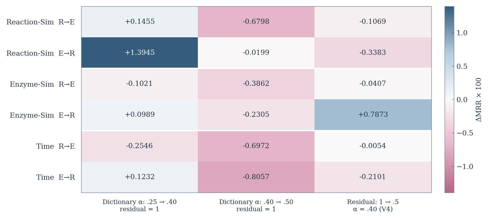
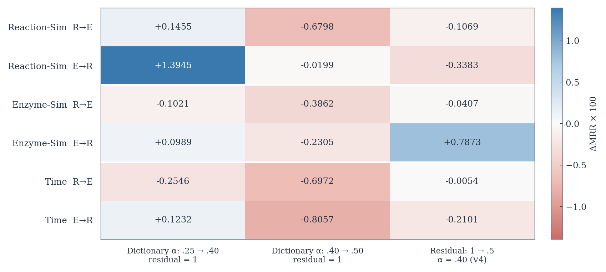

# Palette comparison

The same audited ReactZyme inference figure, with identical values and colour scales. All options retain SciencePlots and the minimal layout. A explores the original pink–blue direction; B is warmer; C changes pink to orange and is the user-selected option. Signed labels support interpretation without hue. Simulations check gradient luminance, not universal accessibility.

## A — Muted navy and dusty rose

## B — Cool blue and soft coral

## C — Blue and orange

