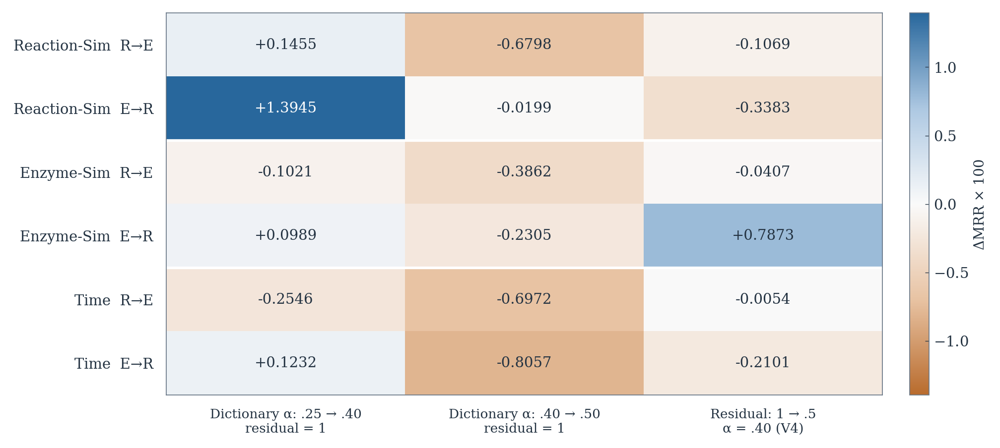
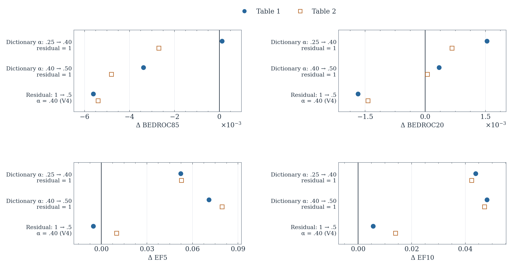
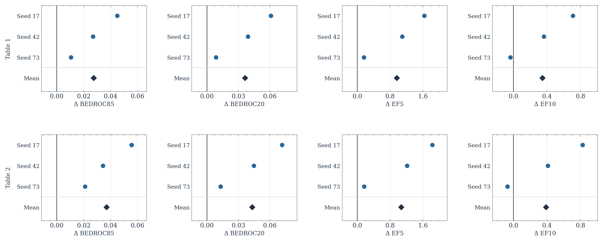
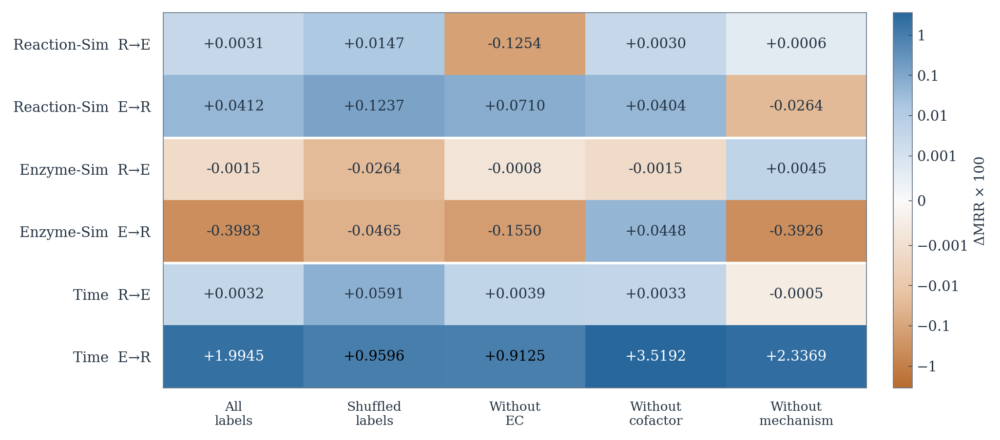
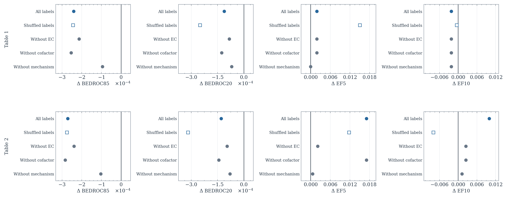
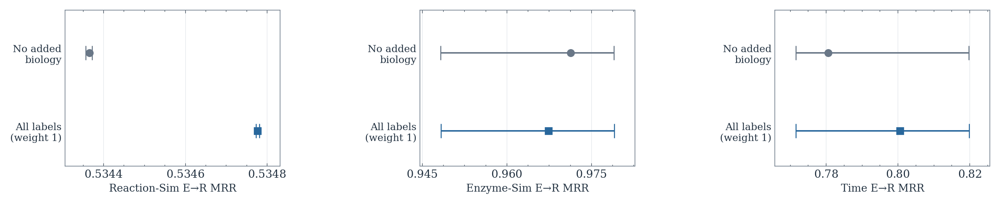
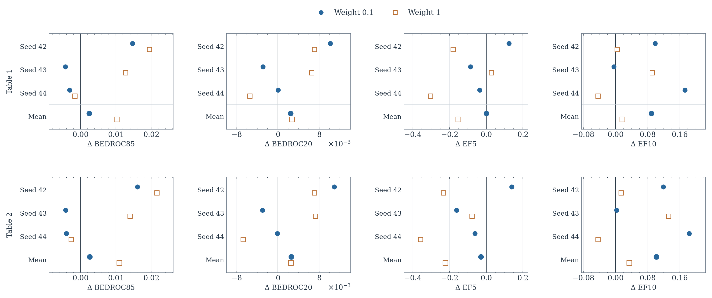
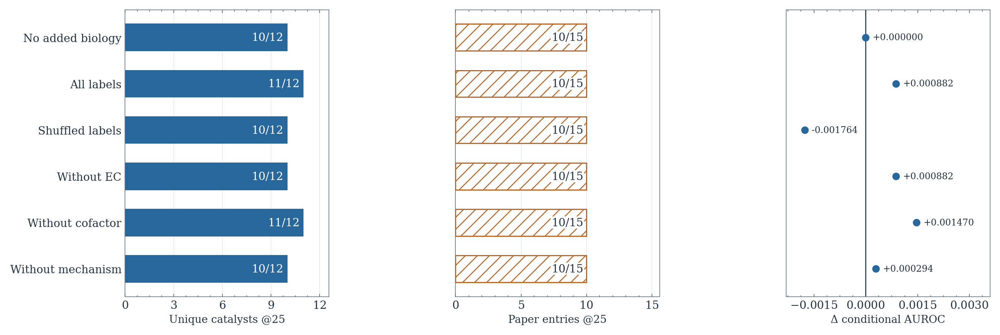

# What the existing V4 runs can establish

## Technical summary

**Yes: the recorded runs support a substantial exploratory ablation study.** The strongest reusable evidence isolates inference weights, added phase-2 biological supervision, and temperature. Three-seed EnzymeMap controls also quantify the instability of adding biological supervision to F3. These results do not yet provide a complete component-removal study of the final V4 architecture.

The study should explain which choices help, hurt, or trade one metric for another. Winning literature comparator cells is not evidence that a particular component caused the win. No new model runs were launched for this audit.

## Keep the two benchmark protocols separate

**ReactZyme:** report all-positive per-query mean reciprocal rank (MRR) in both R→E and E→R directions, separately for Reaction-Sim, Enzyme-Sim, and Time. Do not substitute first-positive MRR. Each contrast must retain the same training split, candidate order, positives, and rank/tie implementation.

**EnzymeMap:** retain the original 34,427/7,287/4,642 train/validation/test association rows. Table 1 evaluates 1,521 eligible unique test reactions against 261,907 candidate IDs. Table 2 removes training enzyme IDs: 1,337 eligible queries and 252,113 candidates. Report BEDROC85, BEDROC20, EF5 and EF10 separately for each setting. BEDROC measures early ranking; EF measures enrichment in the top 5% or 10%. All reported values are raw metric units.

**Case1:** keep the 144 original entries separate from 123 unique protein sequences. The primary-paper positive denominators are 15 entries and 12 unique sequences. This is a retrospective literature panel, not a new wet-lab experiment.

## Five experimental choices already have usable controls

The table classifies evidence by what actually changes, not by the run name. A hyperparameter sensitivity study is useful, but does not prove that the corresponding component is necessary. Missing matched controls below mean a complete final-V4 comparison was not established by this audit; they do not imply that no historical run exists.

**Existing ablation coverage**

| Choice | Evidence | Coverage | Contrast |
| --- | --- | --- | --- |
| Semantic dictionary weight | Controlled sensitivity | All 3 ReactZyme splits + EnzymeMap T1/T2 | α=0.25/0.40/0.50, cap=1; identical weights |
| Phase-2 residual strength | Controlled sensitivity | All 3 ReactZyme splits + EnzymeMap T1/T2 | cap=0.5 vs 1 at α=0.40; identical weights |
| Phase-2 biological labels | Controlled loss ablation | Both benchmarks + retrospective Case1 | None / correct / shuffled / remove EC, cofactor, mechanism |
| Inverse temperature β | Controlled component study | EnzymeMap; seeds 17, 42, 73; 18 epochs | β=5 vs 10; not exact final 10-epoch V4 |
| F3 biological supervision | Paired seed sensitivity | EnzymeMap; seeds 42, 43, 44 | Weights 0/0.1/1, fixed unannotated phase 2 |
| Fusion multiplier | Partial; validation study | Both benchmarks, older recipe variants | Saved calibration/transfer; no complete fixed V4 test grid established |
| Directional encoding / anchor-balanced loss / learned queries | Historical pilots; needs matched V4 controls | Scattered earlier runs | Do not attribute the combined recipe improvement to one component |
| Remove dictionary / remove phase 2 | Needs exact V4 comparison grid | Earlier compositions exist | Use α=0 and residual multiplier=0 with all other V4 settings fixed |

## Inference weights produce measurable trade-offs

**Same trained weights, different inference coefficients:** at residual multiplier 1, raising dictionary weight α from 0.25 to 0.40 improves Reaction-Sim E→R MRR from 0.523804 to 0.537749. EnzymeMap Table 1 BEDROC85 changes little (0.577817→0.577945), while Table 2 decreases (0.536819→0.534129). Raising α further to 0.50 reduces R→E MRR on all three ReactZyme splits.

At α=0.40, reducing the residual multiplier from 1 to 0.5 gives the preferred V4 configuration, but lowers EnzymeMap BEDROC85 in both settings. V4 therefore represents a trade-off; the current evidence does not make the smaller residual universally better. The parameter called “cap” in the code multiplies the residual update; it is not a norm clamp. These runs are single-seed and exploratory. Apparent Enzyme-Sim/Time E→R changes also require the near-tie sensitivity caveat below.

<!-- ablation-plots:inference:start -->

**Figure 1 — ReactZyme inference settings.** Each column is a separate controlled change; the first two adjust dictionary weight and the last adjusts residual strength. Checkpoints and candidate pools remain fixed; results use one seed and were examined during repeated test-set exploration. Cell values are ΔMRR ×100, so +1.3945 corresponds to +0.013945 raw MRR; positive values favor the stated change. Increasing α beyond 0.40 lowers R→E on every split. The preferred residual multiplier 0.5 mainly raises the Enzyme-Sim E→R point estimate; it is not a uniform improvement. Enzyme-Sim and Time E→R require the near-tie sensitivity check in Figure 6.

**Figure 2 — EnzymeMap inference settings.** Blue circles show Table 1 (1,521 queries against 261,907 candidates); open orange squares show Table 2 (1,337 queries against 252,113 candidates after removing training enzyme IDs). Each point is a test difference at a fixed checkpoint, using one seed; right of zero favors the change. Each metric has its own scale. Increasing α from 0.40 to 0.50 improves EF5 and EF10 in both pools while lowering BEDROC85. Reducing the residual to 0.5 also lowers BEDROC85 in both pools. Thus stronger recovery within broad top fractions can coexist with worse very-early ranking; the preferred configuration is a compromise rather than a winner on every screening metric.

<!-- ablation-plots:inference:end -->

**Inference sensitivity: all recorded test cells**

| Benchmark / setting | Metric | α .25 / cap 1 | α .40 / cap 1 | α .50 / cap 1 | α .40 / cap .5 (V4) |
| --- | --- | --- | --- | --- | --- |
| ReactZyme / reaction_smi | E→R MRR | 0.523804 | 0.537749 | 0.537550 | 0.534366 |
| ReactZyme / reaction_smi | R→E MRR | 0.399995 | 0.401450 | 0.394653 | 0.400381 |
| ReactZyme / enzyme_smi | E→R MRR | 0.962493 | 0.963482 | 0.961178 | 0.971355 |
| ReactZyme / enzyme_smi | R→E MRR | 0.667677 | 0.666656 | 0.662794 | 0.666249 |
| ReactZyme / time | E→R MRR | 0.781538 | 0.782770 | 0.774713 | 0.780669 |
| ReactZyme / time | R→E MRR | 0.540884 | 0.538339 | 0.531367 | 0.538285 |
| EnzymeMap / table1 | BEDROC85 | 0.577817 | 0.577945 | 0.574570 | 0.572337 |
| EnzymeMap / table1 | BEDROC20 | 0.755572 | 0.757111 | 0.757460 | 0.755433 |
| EnzymeMap / table1 | EF5 | 16.811991 | 16.864295 | 16.935198 | 16.859042 |
| EnzymeMap / table1 | EF10 | 8.909144 | 8.953017 | 9.001075 | 8.958692 |
| EnzymeMap / table2 | BEDROC85 | 0.536819 | 0.534129 | 0.529326 | 0.528734 |
| EnzymeMap / table2 | BEDROC20 | 0.727165 | 0.727833 | 0.727885 | 0.726403 |
| EnzymeMap / table2 | EF5 | 16.355816 | 16.408538 | 16.488139 | 16.418633 |
| EnzymeMap / table2 | EF10 | 8.736791 | 8.779122 | 8.826313 | 8.793103 |

## Lower inverse temperature has the clearest replicated benefit

**β=5 outperforms β=10 in 22 of 24 paired seed-by-metric comparisons.** Table 1 mean BEDROC85 increases from 0.494040 to 0.521656; mean EF5 increases from 14.685863 to 15.651865. Both improve in all three seeds. EF10 is the exception: it worsens for seed 73 in both screening settings.

The configurations hold architecture, target data, optimizer, 18-epoch budget and phase 2 fixed; current YAML hashes match the archived difference audit. Report this as an EnzymeMap component study. It uses an earlier 18-epoch recipe, so it is not a three-seed ablation of final 10-epoch V4 and supplies no matched ReactZyme temperature result. “±” below is sample standard deviation, not a confidence interval.

<!-- ablation-plots:temperature:start -->

**Figure 3 — Temperature, with every seed visible.** Values are β=5 minus β=10 at 18 fixed epochs. Blue circles show paired differences for seeds 17, 42 and 73; dark diamonds show their arithmetic mean. The upper row is Table 1 and the lower row is Table 2, with pools defined in Figure 2 and matching scales within each metric. All BEDROC85, BEDROC20 and EF5 seed differences favor β=5; seed 73 accounts for both negative EF10 cells. The mean gains therefore have broad within-study support, although their sizes vary by seed. These are 24 correlated metric comparisons from three paired seeds, not 24 independent trials or confidence intervals. This experiment should remain separate from the final 10-epoch V4 study.

<!-- ablation-plots:temperature:end -->

**Paired inverse-temperature comparison**

| Setting | Metric | β=5 mean ± SD | β=10 mean ± SD | Mean Δ (5−10) | Favorable seeds |
| --- | --- | --- | --- | --- | --- |
| table1 | BEDROC85 | 0.521656 ± 0.037549 | 0.494040 ± 0.035007 | +0.027616 | 3/3 |
| table1 | BEDROC20 | 0.700731 ± 0.037011 | 0.664343 ± 0.028084 | +0.036387 | 3/3 |
| table1 | EF5 | 15.651865 ± 0.797827 | 14.685863 ± 0.511695 | +0.966002 | 3/3 |
| table1 | EF10 | 8.516224 ± 0.385573 | 8.168627 ± 0.235072 | +0.347597 | 2/3 |
| table2 | BEDROC85 | 0.477018 ± 0.041572 | 0.439892 ± 0.041803 | +0.037126 | 3/3 |
| table2 | BEDROC20 | 0.666664 ± 0.040874 | 0.623451 ± 0.033362 | +0.043213 | 3/3 |
| table2 | EF5 | 15.023372 ± 0.889137 | 13.953732 ± 0.605670 | +1.069640 | 3/3 |
| table2 | EF10 | 8.297240 ± 0.444524 | 7.907565 ± 0.258370 | +0.389675 | 2/3 |

## Phase-2 biology does not explain the benchmark wins

**This is a clean loss ablation with a mostly negative result for early screening.** Keep F3, existing heads, dictionary and inference fixed; compare no added supervision, correct labels, shuffled labels, and removal of EC, cofactor or mechanism terms at weight 1. The archived unannotated controls reproduce the original head parameters exactly, and this audit confirms identical V4 test values in all 14 cells.

Correct labels give Table 1 BEDROC85 0.572096 versus 0.572337 without them; shuffled labels give 0.572093. The difference between correct and shuffled labels is only about 0.000003. Retaining all three annotation families does not improve every metric. Family-removal contrasts preserve remaining coefficients and the fixed divisor of three; removing a family also reduces total regularization, so shuffled labels are an essential additional control.

The Time E→R point estimate rises from 0.780669 to 0.800614 with biology. However, the archived ±10⁻⁶ score-band diagnostic gives strongly overlapping rank bounds (control approximately 0.77158–0.81982; biology 0.77161–0.81988). These are numerical-sensitivity bounds, not statistical intervals. Do not describe that MRR jump as robust biological generalization.

<!-- ablation-plots:phase2:start -->

**Figure 4 — ReactZyme biological-loss controls.** Values are differences from V4 without added annotation supervision, expressed as ΔMRR ×100. Colors use one shared symmetric logarithmic scale, with a linear region within ±0.001 displayed units (±0.00001 raw MRR), so the largest Time E→R effects do not obscure smaller differences elsewhere. Blue indicates positive differences and orange negative differences. Cell annotations retain the exact displayed metric differences, without a logarithmic transformation; color intensity is nonlinear in magnitude and is not directly comparable to the linear color scale in Figure 1. Correct and shuffled labels use loss weight 1, with the F3 checkpoint, head architecture, inference settings and candidate pools fixed. Removing a label family retains the other loss coefficients but reduces total regularization. These single-seed comparisons are exploratory. Correct labels do not dominate the shuffled or removed-family variants. The largest metric changes occur in Time E→R, precisely where the rank-sensitivity diagnostic below shows broad near-tie bounds; visible color in a small-change cell does not establish a substantial effect.

**Figure 5 — EnzymeMap biological-loss controls.** Each point is the stated phase-2 variant minus V4 without added supervision, using the same controls and weight 1 as Figure 4. The upper row is Table 1 and the lower row is Table 2, as defined in Figure 2; scales match within each metric. Filled blue circles show all labels, open blue squares shuffled labels, and gray circles removed-family controls. Every displayed variant lowers BEDROC85 and BEDROC20 relative to the unannotated control; EF5 and EF10 show mixed small changes. Correct and shuffled labels nearly coincide on BEDROC85. The scientific-notation axes are essential: these BEDROC changes are on the order of 10⁻⁴, not large performance shifts. This is evidence against attributing the benchmark wins to the added phase-2 biological labels.

**Figure 6 — Numerical sensitivity of E→R MRR.** Dots show the recorded metric; segments show the pessimistic and optimistic ranks permitted by a 10⁻⁶ score band. They are not confidence intervals. Reaction-Sim has a small, numerically distinct gain; Enzyme-Sim and Time have strongly overlapping bounds despite larger point-estimate changes. Each panel uses its own labeled, zoomed scale, so compare positions within a panel rather than segment lengths across panels.

<!-- ablation-plots:phase2:end -->

**Phase-2 biological-supervision ablation**

| Benchmark / setting | Metric | None | All, weight 1 | Shuffled | −EC | −Cofactor | −Mechanism |
| --- | --- | --- | --- | --- | --- | --- | --- |
| ReactZyme / reaction_smi | E→R MRR | 0.534366 | 0.534777 | 0.535602 | 0.535076 | 0.534770 | 0.534101 |
| ReactZyme / reaction_smi | R→E MRR | 0.400381 | 0.400412 | 0.400528 | 0.399127 | 0.400411 | 0.400387 |
| ReactZyme / enzyme_smi | E→R MRR | 0.971355 | 0.967373 | 0.970890 | 0.969806 | 0.971804 | 0.967430 |
| ReactZyme / enzyme_smi | R→E MRR | 0.666249 | 0.666234 | 0.665985 | 0.666240 | 0.666234 | 0.666294 |
| ReactZyme / time | E→R MRR | 0.780669 | 0.800614 | 0.790265 | 0.789794 | 0.815861 | 0.804038 |
| ReactZyme / time | R→E MRR | 0.538285 | 0.538317 | 0.538875 | 0.538324 | 0.538318 | 0.538280 |
| EnzymeMap / table1 | BEDROC85 | 0.572337 | 0.572096 | 0.572093 | 0.572124 | 0.572083 | 0.572242 |
| EnzymeMap / table1 | BEDROC20 | 0.755433 | 0.755322 | 0.755183 | 0.755351 | 0.755307 | 0.755364 |
| EnzymeMap / table1 | EF5 | 16.859042 | 16.860921 | 16.874070 | 16.860921 | 16.860921 | 16.859042 |
| EnzymeMap / table1 | EF10 | 8.958692 | 8.956501 | 8.958233 | 8.956501 | 8.956501 | 8.956501 |
| EnzymeMap / table2 | BEDROC85 | 0.528734 | 0.528464 | 0.528460 | 0.528496 | 0.528451 | 0.528631 |
| EnzymeMap / table2 | BEDROC20 | 0.726403 | 0.726275 | 0.726085 | 0.726308 | 0.726261 | 0.726324 |
| EnzymeMap / table2 | EF5 | 16.418633 | 16.435718 | 16.430386 | 16.420760 | 16.435718 | 16.419255 |
| EnzymeMap / table2 | EF10 | 8.793103 | 8.803076 | 8.785184 | 8.795596 | 8.795596 | 8.794350 |

## F3 biology improves some averages but remains seed-sensitive

**The F3 study is a different experiment from the phase-2-only study above.** It retrains F3 with added relative biological loss at weight 0.1 or 1 and retains the unannotated phase-2 objective. Within each seed, compare to its corresponding unannotated control.

At weight 1, the mean Table 1 BEDROC85 gain is +0.010256, favorable in two of three seeds; mean EF5 falls by 0.151444. Table 2 EF5 decreases in all three seeds. At weight 0.1, Table 1 BEDROC85 improves in only one of three seeds. Thus seed 42 alone would overstate reliability. The nine raw results and paired differences are preserved in the companion data. The archived seed-42 control is reused; a separately recorded fresh seed-42 audit supports similar, but not bit-identical, behavior. Three seeds remain too few to claim a robust generalization mechanism.

<!-- ablation-plots:f3:start -->

**Figure 7 — F3 biology, with every paired seed retained.** Each point is a biological-loss variant minus its same-seed unannotated control; the mean row shows arithmetic means. Blue circles indicate loss weight 0.1 and open orange squares weight 1. Nine runs cover seeds 42, 43 and 44, with the archived control used for seed 42; phase 2 remains unannotated. The upper row is Table 1 and the lower row is Table 2, as defined in Figure 2, with matching scales within each metric. Seed 42 supplies much of the positive BEDROC effect; seed 44 generally favors the unannotated control. Weight 1 lowers Table 2 EF5 in all three seeds, even though its average BEDROC85 increases. Weight 0.1 consistently improves Table 2 EF10, but does not consistently improve the other metrics. This is a mixed loss trade-off, not yet a reliable improvement across early-screening objectives.

<!-- ablation-plots:f3:end -->

**EnzymeMap F3 biological-loss seed sensitivity**

| Setting | Metric | No added loss, mean ± SD | Weight .1, mean ± SD | Δ .1 (positive seeds) | Weight 1, mean ± SD | Δ 1 (positive seeds) |
| --- | --- | --- | --- | --- | --- | --- |
| table1 | BEDROC85 | 0.514163 ± 0.052255 | 0.516643 ± 0.062410 | +0.002480 (1/3) | 0.524419 ± 0.062105 | +0.010256 (2/3) |
| table1 | BEDROC20 | 0.703082 ± 0.050735 | 0.705522 ± 0.056210 | +0.002440 (2/3) | 0.705812 ± 0.056920 | +0.002729 (2/3) |
| table1 | EF5 | 15.782522 ± 1.127243 | 15.784421 ± 1.203771 | +0.001899 (1/3) | 15.631078 ± 1.209284 | -0.151444 (1/3) |
| table1 | EF10 | 8.601700 ± 0.361722 | 8.691042 ± 0.332568 | +0.089342 (2/3) | 8.619058 ± 0.392116 | +0.017358 (2/3) |
| table2 | BEDROC85 | 0.462274 ± 0.060143 | 0.464925 ± 0.071374 | +0.002651 (1/3) | 0.473283 ± 0.071549 | +0.011009 (2/3) |
| table2 | BEDROC20 | 0.665891 ± 0.058468 | 0.668512 ± 0.064439 | +0.002621 (1/3) | 0.668423 ± 0.065265 | +0.002532 (2/3) |
| table2 | EF5 | 15.189814 ± 1.302260 | 15.162507 ± 1.397232 | -0.027306 (1/3) | 14.967468 ± 1.381411 | -0.222346 (0/3) |
| table2 | EF10 | 8.375648 ± 0.410359 | 8.477480 ± 0.390518 | +0.101833 (3/3) | 8.410045 ± 0.444943 | +0.034398 (2/3) |

## Case1 supports a small retrospective observation

**For the Reaction-Sim model, phase-2 biology moves one literature-supported catalyst from rank 26 to rank 25 in the unique-sequence analysis.** Recovery therefore changes from 10/12 to 11/12 at 25. The original 144-entry analysis remains 10/15. Removing the cofactor term retains the unique-sequence change and slightly increases conditional AUROC.

The table uses the same Reaction-Sim checkpoint lineage for every row; it does not choose the best benchmark-trained checkpoint per metric. AUROC distinguishes workbook-reported activity from conditional non-detection, not universal biochemical negatives. The panel was inspected earlier in development, so it cannot serve as untouched or prospective validation.

<!-- ablation-plots:case1:start -->

**Figure 8 — Case1 under different evaluation units.** All variants use the same Reaction-Sim model lineage and phase-2 loss weight 1. The left panel measures recovery at rank 25 among 123 unique candidate sequences, including 12 paper-supported catalysts. The middle panel measures recovery at rank 25 among the original 144 entries, including 15 paper-supported entries. The right panel shows conditional AUROC differences from the unannotated control (AUROC 0.612875), using workbook-reported activity and non-detection labels. Correct labels and the cofactor-removal control recover one additional unique paper-supported catalyst at rank 25. All six methods still recover 10 of the 15 paper-supported entries when the original 144-row panel is ranked. Conditional AUROC changes by less than 0.002 in either direction. The observation therefore concerns one sequence crossing a cutoff in a retrospective literature panel; it does not establish a prospective wet-lab activity improvement.

<!-- ablation-plots:case1:end -->

**Case1 phase-2 controls: Reaction-Sim model**

| Added biology | Unique paper catalysts @25 | Paper entries @25 / 144 | Conditional AUROC |
| --- | --- | --- | --- |
| control | 10/12 | 10/15 | 0.612875 |
| all | 11/12 | 10/15 | 0.613757 |
| without_ec | 10/12 | 10/15 | 0.613757 |
| without_cofactor | 11/12 | 10/15 | 0.614345 |
| without_mechanism | 10/12 | 10/15 | 0.613169 |
| shuffled_1 | 10/12 | 10/15 | 0.611111 |

## A full architectural explanation still needs matched removals

Historical pilots changed combinations of reaction encoding, model size, losses, training duration, validation rules and downstream composition. Their scores are useful development evidence, but juxtaposing their best checkpoints would not isolate directional F3, anchor balancing, learned residue queries, or phase 2. The saved fusion experiments also include validation-selected transfers rather than a complete final-V4 test grid.

Repeated test inspection makes this entire retrospective study exploratory. Keep all arms, use validation for future selection, report paired seeds, and preserve failed or negative variants. Added EC/cofactor/mechanism annotations are additional supervision even when association training data and architecture are matched. Do not describe the biology arms as identical-information comparisons. Literature thresholds and currently running public competitors are external comparisons, not V4 component ablations.

## Complete the paper study with a small fixed matrix

1. **First, finish the inference removals using existing weights:** V4; α=0; residual multiplier=0; both zero; fusion multiplier=1 with other V4 settings fixed. This isolates dictionary, residual and fusion contributions without retraining. Compare all four target-specific fits, not just the most favorable split.
2. **Then retrain only architecture/loss controls that lack matched runs:** original MLNCE versus anchor-balanced loss; ordered versus direction-invariant chemistry on EnzymeMap; four learned residue queries versus one (or no learned-query view). Change one choice at a time and retain the same frozen inputs, 10-epoch budget, phase 2, inference settings and paired seeds. ReactZyme participant sets do not provide physical reaction sides, so do not claim that split alone tests chemical directionality.
3. **Use one reference throughout:** unannotated V4 for architecture and inference ablations; V4 plus weight-1 phase-2 biology as a separately labeled extension with correct/shuffled/family-removal controls. Do not combine best cells from different models.
4. **Report both benchmarks:** six ReactZyme MRR cells plus eight EnzymeMap screening cells; show per-seed points and mean ± sample SD where replicated. Revisit Case1 only after configurations are fixed. No new runs have been scheduled by this audit.

## Questions the existing evidence cannot yet settle

Does the dictionary account for most of the final score gain? Are learned residue queries necessary once frozen protein features and phase 2 are held fixed? Does anchor balancing improve generalization independently of temperature and directional encoding? Can any added biological supervision produce consistent benefit across seeds and an independently collected reaction panel? These are the next defensible ablation questions; the existing winning scores alone do not answer them.

<!-- ablation-plots:reproduce:start -->

All figures are available as embedded PNGs and editable [SVG / PDF exports](figures/README.md). Rebuild them with `python3 documents/ablation_study_20260921/plot_study.py`. The [plotting code](plot_study.py), [plotted differences](figures/plotted_contrasts.csv) and [figure/source manifest](figures/manifest.json) preserve the exact comparisons. No training or new test evaluation was performed to make these plots.

Figure styling uses [SciencePlots](https://github.com/garrettj403/SciencePlots) (`science`, `no-latex`) and the selected blue–orange palette, with a neutral midpoint for signed differences. Figures contain only plotted data, essential axes and legends; titles, interpretation and scope notes are in the manuscript captions above. Marker shapes, hatching and signed labels retain information without relying on color. The [palette diagnostics](figures/palette_accessibility.json) include protanopia, deuteranopia and tritanopia simulations.

<!-- ablation-plots:reproduce:end -->

Audit companions: [executed notebook](audit.ipynb), [260 measurements](measurements.csv), [raw-source hashes and paired tables](evidence.json), [rebuild script](build_study.py). These checks verify saved summaries and provenance; predictions were not recomputed. The HTML export is blocked by the bundled report validator requiring SQL provenance for local-file/Python evidence; the full report is preserved here without inventing a SQL source.
