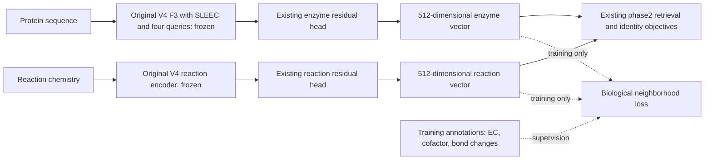

# Biological supervision without expanding V4

The method keeps V4's existing dual encoder, SLEEC, phase-2 refinement and training-reaction dictionary. EC, cofactor and mechanism annotations provide **training supervision on the existing embeddings**. They do not become new model inputs, prediction heads, attention slots or inference branches. An unannotated reaction and an unannotated protein can still be scored.

The simplest completed result applies relative biological supervision only to the existing phase2: weights 1 and 3 preserve all 14 primary benchmark wins and recover 11/12 literature catalysts in the top25 of the 123 unique Case1 sequences, versus V4's 10/12. On the original 144-entry panel, all three recover 10/15 paper-supported entries at25; the unique-sequence gain must not be advertised as an entry-level gain. Conditional activity AUROC moves from 0.612875 to 0.613757/0.615520. This is modest retrospective preservation/improvement, not a demonstrated generalization breakthrough. [Full phase2 results](v4_relative_biology_phase2_20260921.md).

The extra unique catalyst is TsT4Ease WT, moving from rank26 to25. This one-place cutoff crossing accounts for the apparent recall gain; it does not establish a broad improvement in activity discrimination.

Fresh F3 with relative biological loss at weights 0.1 and 1.0 also exceeds all 14 primary targets, both with and without biological supervision in phase2. However, its unique-sequence Case1 catalyst recovery drops to 7/12 and 6/12 respectively. These are benchmark wins with a real-case regression. The complete results and controls, rather than the architectural motivation, determine the performance claim.

## What actually changes

For the conservative phase2 variants, the original target-specific F3 fits are retained, including SLEEC and all four learned residue queries. Only the objective used to train the existing residual heads changes:

\[
L_{\mathrm{phase2}}=L_{\mathrm{positive\ CE}}
+10L_{\mathrm{identity}}
+\frac{\lambda}{3}(L_{\mathrm{EC}}^{\mathrm{relative}}
+L_{\mathrm{cofactor}}^{\mathrm{relative}}
+L_{\mathrm{mechanism}}^{\mathrm{relative}}).
\]

Weights1 and3 are the two reported variants that retain all benchmark targets and the11/12 unique-sequence Case1 result. Both use the same100 updates, learning rate1e-4, temperature0.2, identity weight10, and existing512→1024→512 residual heads. These heads already belonged to V4. Their actual saved state has exactly the same parameter names, shapes and2,102,272 values as the original phase2 control. Annotations supervise the geometry of the existing outputs; they are not appended to the inputs. No EC classifier, cofactor predictor or mechanism head is introduced.

The original F3 models were trained separately from scratch on each benchmark's own training associations. Freezing them for phase2 does not mean reusing a ReactZyme-trained F3 on EnzymeMap. Each target retains its own F3, residual heads and training dictionary. The new phase2 loss does not change the learned residue queries; their interpretation below comes from the original architecture and direct checkpoint diagnostics.

For the separate fresh-F3 experiments, the objective is

\[
L = L_{\mathrm{V4}} + \frac{\lambda}{3}
  (L_{\mathrm{EC}} + L_{\mathrm{cofactor}} + L_{\mathrm{mechanism}}).
\]

The attraction experiment uses \(\lambda=0.1\); the relative-loss experiments use \(\lambda=0.1\) and \(1.0\). The original V4 objective includes the existing decoupled, anchor-balanced multi-positive contrastive loss and attention safeguards. Those remain in place. Each biological term acts on the same final 512-dimensional vectors used for retrieval. Gradients flow through the existing reaction encoder and trainable protein aggregation. The frozen pretrained feature encoders and SLEEC scorer remain frozen.

Two predeclared fresh-F3 variants are evaluated. `f3_biology` uses biological supervision in F3 training and the original phase-2 objective. `f3_phase2_biology` uses the same biological supervision in F3 and adds it to the existing phase-2 objective as well. Both retain the same phase-2 model and inference recipe. In the earlier phase-2-only study, F3 was already frozen, so the biological loss could change only the residual refinement.

This diagram shows the recommended phase2 training placement. The annotations act through a loss on the existing vectors. Inference still applies the existing residuals and fixed semantic score. No biological loss is evaluated during inference. In the separate fresh-F3 experiments the same kind of supervision was also applied before phase2; those results are reported separately because their Case1 behavior differs.

The reaction input contract also remains unchanged. ReactZyme supplies molecular participant sets with no physical reaction arrow; the established adapter places the set on both sides. EnzymeMap supplies physical reactant/product sides. The same tower accepts both, but cannot recover missing chemical direction from the ReactZyme input. Retrieval direction, R→E or E→R, is a separate concept.

## Three kinds of vectors, three different meanings

| Vector | Meaning | Is it positional encoding? |
| --- | --- | --- |
| Four learned protein queries, each 256-dimensional | Shared content selectors that weight the residue representations | No |
| Final 512-dimensional reaction/enzyme embedding | A learned point in a common retrieval space | No |
| Semantic coordinates indexed by training reactions | Similarity and training-association support for explicit reaction anchors | No |

These should not be conflated. The learned queries are model parameters. The final embedding is an example-dependent representation. The semantic vector uses an explicit dictionary of training reactions and is computed from the existing frozen features and training associations.

### The four learned queries

For residue representation \(h_i\), the existing encoder creates an adapted feature, a normalized key \(k_i\), and a value \(v_i\). Each global learned query \(q_j\) produces attention

\[
a_{ji} = 0.95\,\operatorname{softmax}_i
  \left(\tau\,\hat q_j^\top\hat k_i\right)
  + 0.05/\ell,
\qquad
s_j = \sum_i a_{ji}v_i,
\]

over the \(\ell\) valid residues. The scale \(\tau\) is bounded, and padding is masked. There are four queries, shared across every protein, rather than one learned vector for each sequence position. They give the encoder several ways to summarize informative residue content.

A query might become sensitive to patterns relevant to catalysis, binding or family identity. That is a hypothesis to inspect, not a label assigned by the architecture. We do **not** claim that slot 1 represents EC, slot 2 represents cofactors, or any particular slot identifies a catalytic site. The new loss supervises the final representation, so the model may distribute the information across slots and other existing branches.

The pooler has no added residue-position table. Reordering the already computed residue vectors, masks and SLEEC scores together leaves its output unchanged, up to floating-point tolerance; a unit test verifies this property. This does **not** mean that reordering the amino-acid sequence is harmless. ProtT5 has already encoded sequence context before these residue vectors reach the pooler.

An additional checkpoint diagnostic measures these views on 128 validation proteins absent from target training by exact protein ID. Their normalized raw attention entropy is about 0.94, and effective support spans roughly 74% of each sequence. The learned queries therefore behave as broad content summaries in these models, not sharp catalytic-site detectors. Centered inter-query attention cosine is about 0.55, indicating substantial overlap. Biological supervision changes these aggregate statistics only slightly. The actual trained checkpoints also pass the residue-array permutation check. [Per-model measurements and definitions](v4_biological_query_audit_20260921.md).

### The SLEEC and global views

The global view summarizes all valid residue vectors. The SLEEC view pools them using the frozen scorer's outputs. These two views join the four learned views in the existing gated aggregation. SLEEC therefore remains a distinct source of residue-level biological bias even when the new annotations are unavailable.

On the same 128-protein diagnostic, the SLEEC view receives about 33% of the mean gate mass, compared with about 18% for the global view and about 49% collectively for the four learned views. These are gates within the fused branch, averaged over feature dimensions. They are not causal importance percentages or shares of the final retrieval score.

V4 combines a normalized global output \(g_e\) with a normalized fused-view output \(f_e\):

\[
z_e = \operatorname{normalize}(g_e+s f_e).
\]

The learned scale \(s\) starts at 0.1. The fixed V4 inference recipe uses \(3s\) after fitting; this is preserved for comparison. It strengthens the entire fused branch, which includes global, SLEEC and learned views. The new biological supervision changes how the existing trainable parts learn; it does not add another view.

### The final retrieval vectors

Each reaction and enzyme receives a 512-dimensional vector. The retrieval loss makes experimentally associated pairs compatible in this space. The biological loss additionally encourages appropriate within-reaction and within-enzyme neighborhoods.

Individual coordinates have no fixed biological meaning. Rotating a representation and consistently transforming the corresponding projections can preserve its similarity structure. Thus “dimension 37 is NAD dependence” would be an unsupported interpretation. Biological meaning is better assessed through neighborhoods, controlled annotation removal, retrieval behavior and follow-up experiments.

### The semantic dictionary

The existing semantic part differs from the learned 512-dimensional representation. Its coordinates correspond to target-training reactions. A reaction is compared with those training reaction features; a protein receives support through similar training proteins and their training associations. That gives the coordinates an explicit dictionary interpretation.

This dictionary was already part of V4. The new annotation loss neither enlarges it nor adds EC/cofactor/mechanism coordinates. The final score retains V4's 0.6 neural similarity plus 0.4 semantic similarity.

## How each annotation becomes supervision

The loss uses observed shared categories as soft positive relationships within each endpoint type. Reaction categories regularize reaction vectors; enzyme categories regularize enzyme vectors. The original reaction–enzyme contrastive objective connects the two spaces.

**EC hierarchy.** A known EC assignment contributes its known ancestral prefixes. Shared broad classes receive less weight than a shared specific class: levels 1, 2, 3 and 4 use weights 0.125, 0.25, 0.5 and 1. The hierarchy describes functional classification, not sequence location. Partial EC assignments contribute only their known levels.

**Cofactors.** Cofactor-related categories come from recognized participants in the training reaction chemistry. Presence is an imperfect proxy for catalytic requirements, so its confidence is reduced to 0.4. For two such annotations, the pair contribution is multiplied by \(0.4^2\). We do not label every reaction containing a molecule as mechanistically dependent on that molecule.

The EnzymeMap training annotations cover 4,915 of 12,603 reactions. Category membership counts are NAD/NADP 3,400, CoA 1,566, quinone 155, FAD/FMN 20 and generic metal 2; memberships can overlap. In the held-out validation-rule diagnostic, only five of 2,652 reactions receive recognized cofactor categories. This severe coverage shift limits what the validation geometry can establish about cofactors. A required enzyme-bound cofactor omitted from the reaction string is invisible to this participant-based annotator. Missing recognition must not be interpreted as cofactor independence.

**Mechanism descriptors.** Categories summarize atom-mapped bond changes. Low-confidence mappings below 0.5 are omitted; retained evidence is confidence-weighted. These are coarse transformation descriptors. They do not establish a complete catalytic mechanism, transition state or residue-level mechanistic assignment.

The resulting EnzymeMap vocabulary contains four observed categories: phosphate transfer, redox/carbonyl interconversion, stereochemical rearrangement and sulfur/thiol chemistry. It covers 8,440 of 12,603 training reactions. Calling this a detailed mechanistic model would overstate the supervision; it is a bias toward broad transformation relationships.

Where reaction categories are propagated to proteins, only retained training associations are used. Native training-protein EC annotations may describe more than one activity. That is explicitly different from claiming a precise EC assignment for every reaction–protein edge.

Missing annotations create no biological attraction or repulsion. Different labels never assert that an enzyme lacks catalytic activity. In the relative-loss variant below, other annotated categories serve as geometric references and can produce repulsive gradients. Incomplete labels, multifunctional proteins and promiscuity make those references imperfect. The original retrieval objective still supplies its existing contrastive discrimination.

## The exact neighborhood penalty

For category \(c\), with \(n_c\) distinct annotated training endpoints and confidence \(w_i\), its contribution is

\[
D_c = \frac{1}{n_c(n_c-1)}
\sum_{i\ne j}w_iw_j\left(1-\hat z_i^\top\hat z_j\right).
\]

Categories containing fewer than two endpoints contribute nothing. Category weights balance their average contributions, rather than letting a large category dominate solely through its number of pairs. The reaction and enzyme terms are averaged, followed by the fixed average over the three annotation families.

The denominator is the number of pairs, not their confidence mass. This matters: dividing by confidence mass would cancel a common low confidence and make weak annotations as strong as certain ones. Here, lower confidence genuinely weakens supervision.

The implementation computes the exact pair sum from category-level weighted vector sums. It does not construct a dense all-pairs matrix, add a memory bank or sample extra negatives. Phase 1 uses the deduplicated endpoints in each minibatch. Phase 2 uses the compact full training graph. The mathematics is the same, but minibatch category availability means their effective supervision is not identical.

The loss encourages compatibility, not universal equivalence. A broad EC class or common cofactor can join proteins with very different substrate specificity. Excessive attraction could damage retrieval. The small weight, graded EC ancestry, reduced-confidence proxies and retained contrastive objective limit this risk; the ablations determine whether those choices help in practice.

Equal family coefficients do not imply equal training influence. A post-fit gradient diagnostic on the actual weight3 phase2 heads finds EnzymeMap gradient norms of about0.25%,3.50% and25.36% of the retrieval gradient for EC, cofactors and mechanism respectively. On Reaction-Sim the corresponding values are1.11%,0.49% and4.32%. Mechanism is the largest of these local biological gradients, but these ratios are not causal importance percentages or Adam update sizes. The diagnostic changes no parameters and reads only training endpoints.

The existing identity-preservation penalty has a gradient norm comparable to the retrieval gradient, pointing almost exactly opposite on the three ReactZyme fits. This is consistent with a conservative refinement that balances fitting associations against preserving the original geometry. It does not prove that changing that penalty would improve generalization. Cofactor loss has zero local gradient at the fitted Enzyme-Sim checkpoint, despite having annotated training examples; one final gradient cannot describe its influence throughout training. [All four targets, local gradient definitions and source hashes](v4_biology_gradient_audit_20260921.md).

## What would demonstrate a contribution

The unannotated V4 control establishes the reference. Removing one family keeps the other family coefficients unchanged, with the divisor remaining three. The shuffled control preserves annotation profiles and category counts while breaking their assignment to the true training endpoints. Both are needed: an improvement over V4 alone could reflect regularization or a changed optimization trajectory.

A useful family should improve the actual benchmark metrics relative to its matched removal, with uncertainty and tradeoffs reported. A family can help BEDROC85 while hurting EF5. If shuffling performs similarly, there is weak evidence that the specific biological assignments matter. If removing a family helps, it should not be presented as a positive contribution.

The matched phase-2-only study already shows why this caution matters: most gains over V4 are tiny, shuffled labels also retain benchmark wins, and large ReactZyme Time E→R changes can be driven by nearly tied scores. The fresh-F3 study provides the stronger training-stage test. Its EnzymeMap contribution controls are full retrainings, not merely annotation removal at inference.

## Follow-up: relative biological neighborhoods

The fresh-F3 attraction experiment improves EnzymeMap BEDROC85 over V4, but shuffled labels improve it slightly more. Removing cofactor supervision also helps. This is evidence against attributing the entire gain to the correct biological assignments. The complete positive and negative contributions are retained in the [contribution audit](v4_biology_contributions_20260921.md).

The follow-up changes only the mathematical loss. For each category, it compares the confidence-weighted mean distance among category members, \(d_{\rm within}\), with their distance to other endpoints annotated in that family, \(d_{\rm background}\):

\[
L_c^{\rm relative}=\overline{w_iw_j}\,
\max\{0,\;0.1+d_{\rm within}-d_{\rm background}\}.
\]

An endpoint with no annotation in that family is excluded from both groups. A category with fewer than two members or no annotated comparison group is skipped. For multiply annotated endpoints, background confidence uses their strongest observed confidence in that family. Confidence-weighted distance means are computed before the hinge; the mean within-category pair confidence then scales the result, so uncertainty is not normalized away.

The motivation is to encourage biological peers to be relatively close, rather than merely making an entire embedding space more compact. This is not a mathematical guarantee against collapse: reducing all distances can still reduce a penalty for incorrectly ordered groups, and a completely collapsed representation can have zero gradients despite nonzero hinge loss. The retained retrieval objective remains essential. The category complement is an imperfect representation reference, not a declaration that those enzymes cannot catalyze the reaction. Multifunctionality and incomplete annotations remain limitations.

Exact category sums also compute this relative loss without a dense pairwise matrix. No new inference component, parameter, feature channel or annotation requirement is introduced. New tests compare its value and gradients with explicit weighted pair enumeration, check confidence scaling and verify that missing annotations stay neutral.

This follow-up is exploratory and was declared after inspecting the attraction controls. Its results are kept separately in the [relative-loss report](v4_relative_biology_f3_20260921.md); it does not retrospectively replace the first experiment.

## What is verified, and what remains an empirical claim

- The checkpoint audit compares model configurations, state tensor names and shapes, training/validation source hashes, core optimization settings and frozen SLEEC weights against V4.
- The loss is tested against explicit pair enumeration, including gradients, confidence scaling, missing-label neutrality and rejection of non-training identifiers.
- A gradient test confirms that biological supervision can reach the existing residue queries with no biological readout head.
- A completed biological F3 checkpoint was loaded with an intentionally nonexistent annotation path and successfully encoded residue inputs into finite 512-dimensional vectors. Its annotation helper remained uninitialized. This checks that inference does not depend on annotation files; it is not an accuracy test.
- A pooling test distinguishes content selection from array-position encoding.
- Benchmark and Case1 evidence are reported separately. Case1 contains literature-derived activities and related constructs; it is not a new wet-lab validation or proof of broad generalization.

Matching downstream training associations does not imply identical total information across competitors. The added biological annotations and frozen pretrained resources must remain disclosed. EnzymeMap native annotations come from its permitted training entries; ReactZyme also uses the documented training-endpoint annotation sources. Neither evaluation labels nor Case1 outcomes are used to build this annotation loss.

The fresh ReactZyme runs disable the expensive internal retrieval validation while retaining validation loss and fixed epoch checkpoints. Original V4 runs enabled that retrieval diagnostic and continued to epoch 20; comparison here uses their saved epoch-10 weights. The constant learning-rate schedule is unchanged. Extra validation iterators can affect random-number consumption, so fresh-versus-original ReactZyme score changes are not claimed to isolate the annotation loss perfectly. The phase-2-only comparisons hold F3 fixed, and the fresh EnzymeMap annotation controls share the same validation behavior. These distinctions are recorded in the checkpoint audit.

[Fresh-F3 results](v4_biological_f3_20260921.md) · [Phase-2-only results](v4_biological_geometry_20260921.md) · [Original V4 explanation](v4_extensive_explanation.md)

## Current empirical limit

The complete first fresh-F3 study exceeds 13 of the 14 primary benchmark targets. Enzyme-Sim E→R is 0.954584 with biology in F3 and 0.954336 with biology in both stages, below the 0.956 comparator. Numerical tie sensitivity is large on this split, but the official qualification rule is unchanged: these fresh configurations do not qualify for the all-target Case1 follow-up. The earlier phase-2-only biological configurations retain all 14 point comparisons and their separate Case1 results.

The first fresh-F3 chemistry audit explains the fragile ranks: all 542 Enzyme-Sim positive associations with a competitor within 1e-6 have a competing reaction identifier with identical canonical molecular participants. The corresponding Time count is 1,281 of 1,286. Canonicalization retains stereochemistry and molecule multiplicity. These are chemically equivalent released inputs even though their identifiers differ. The audit does not change the candidate pool, labels or official metric. It shows why movements in this part of E→R MRR cannot be equated with improved biochemical discrimination.

The three-seed EnzymeMap attraction study shows substantially larger variation across seeds than the typical gain from biological supervision. The seed affects initialization, batch order and dropout, so this does not isolate initialization alone. The relative loss with weight0.1 has positive conditional cofactor and mechanism contributions on several metrics at seed42, yet its shuffled-label control remains stronger on BEDROC85. Neither study supports assigning a fixed biochemical meaning to each learned query.

The stronger relative loss, F3 weight1.0, provides a more encouraging but still mixed EnzymeMap result: BEDROC85 is 0.591840/0.550281 for the two screening settings. Correct labels exceed the corresponding shuffled control by about 0.0064 in both; reaction-rule bootstrap intervals still include zero. Retaining mechanism supervision improves BEDROC85 by 0.016321/0.018747 over its matched removal. EC also helps BEDROC85 but reduces EF5/EF10, and cofactors offer no consistent benefit. Validation category separation improves slightly for EC and mechanism. Across three seeds, the stronger loss improves BEDROC85 in two and worsens one, with mean paired gains of 0.010256/0.011009. EF5 declines on average. This supports further testing of biological geometry, without establishing a semantic identity for any individual learned query.

The completed fresh-F3 relative-loss Case1 evaluations do not support improved real-world transfer: the Reaction-Sim model's conditional AUROC falls from V4's 0.612875 to 0.551146 at weight0.1 and 0.509112 at weight1.0. The EnzymeMap-trained models remain below0.5 on this heterogeneous panel. These outcomes are retained alongside the benchmark wins.

The matched fresh controls are now complete. Unannotated F3 with the same fast validation cadence exceeds all14 benchmark targets, but gives8/12 unique Case1 catalysts and AUROC0.568783 with its Reaction-Sim model. Original V4 gives10/12 and0.612875. Relative F3 biology further reduces the matched-control results to7/12 and0.551146 at weight0.1, or6/12 and0.509112 at weight1. Therefore, part of the original-versus-fresh Case1 difference belongs to the changed training trajectory, and an additional decrement remains associated with biological supervision under the matched protocol. The comparison does not isolate validation cadence as the sole cause of the original trajectory difference.

On ReactZyme, all three fresh biological losses reduce Reaction-Sim R→E MRR relative to the matched unannotated0.405064; relative0.1 improves E→R from0.539420 to0.546721. Other effects are mixed, and Enzyme-Sim/Time E→R remain numerically sensitive. The extra relative0.1 phase2-only control on fresh unannotated F3 also qualifies on all14 targets and retains8/12 Case1 catalysts. These results reinforce using the original V4 F3 for the conservative biological phase2 variants. [Matched benchmark controls](v4_matched_reactzyme_controls_20260921.md) · [Matched control Case1 evaluations](v4_matched_control_case1_20260921.md).

Keeping the original F3 fixed and applying relative supervision only to phase2 avoids that large Case1 regression at weights1/3. It slightly reduces EnzymeMap BEDROC85, while retaining all published primary targets. Weight10 also qualifies, but returns to 10/12 unique paper catalysts and AUROC0.611993. All three declared weights are reported, rather than replacing the unsuccessful fresh-F3 experiments.

Matched family-removal and shuffled controls at weights1/3 also retain all14 benchmark point wins. At weight3, retaining cofactors improves BEDROC85 by0.000181/0.000221 over cofactor removal. Retaining mechanism decreases BEDROC85 by0.001014/0.001116 while improving EF10 by0.023828/0.028769. Correct labels trail shuffled assignments on BEDROC85 by0.000883/0.000969, but improve EF10. These are mixed, small conditional effects, not evidence that every annotation family improves V4. [Weight1 contributions](v4_relative_biology_phase2_weight1_controls_20260921.md) · [Weight3 contributions](v4_relative_biology_phase2_weight3_controls_20260921.md).

All eight controls have completed Case1 evaluation. Removing mechanism or shuffling labels returns unique-catalyst recovery to10/12 at both weights, compared with11/12 for the full loss. EC removal gives10/12 at weight1 but11/12 at weight3. Cofactor removal preserves11/12 and slightly improves AUROC; retaining all families is not uniformly best. All these Reaction-Sim models still recover10/15 paper entries in the original144-entry panel. This supports a conditional role for mechanism supervision in the single cutoff crossing, not a general claim of improved catalysis prediction. [All Case1 annotation controls](v4_relative_biology_phase2_case1_controls_20260921.md).

Additional EnzymeMap controls show that the true relative-loss annotations outperform shuffled assignments on BEDROC85 in two of three seeds, but underperform in the third and reduce mean EF5. A fresh seed42 unannotated F3 reproduces every original checkpoint state tensor bit for bit. Small downstream score differences remain after feature export and phase2 fitting. This distinguishes exact F3 reproducibility from exact end-to-end rank reproducibility. [Additional controls and source hashes](v4_biology_additional_controls_20260921.md).

[Seed sensitivity and figure](v4_biology_seed_sensitivity_20260921.md) · [Relative-loss contributions](v4_relative_biology_contributions_20260921.md)

[Stronger relative-loss contributions and uncertainty](v4_relative_biology_weight1_contributions_20260921.md)
