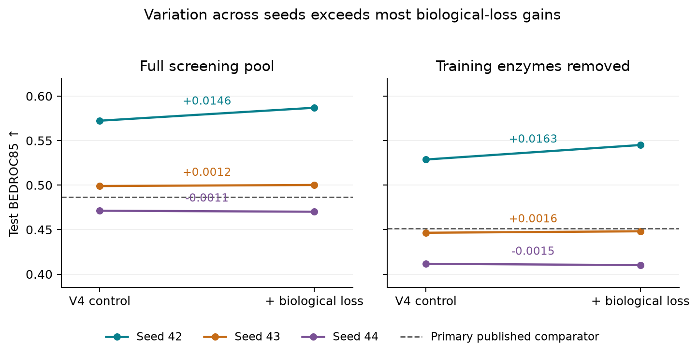

# Biological F3: EnzymeMap seed sensitivity

Three fixed seeds, no seed selection or score ensembling. All have original unannotated phase2; this isolates F3 annotation supervision within each pair. Seed42 control is the archived V4 fit, seeds43/44 are new matched controls. The seed affects initialization, batch order and dropout; this is not an isolated initialization ablation. Few seeds and repeated tests preclude a confirmatory significance claim.

| Table / metric | V4 mean ± sample SD | Biological F3 mean ± sample SD | Paired mean difference | Seeds improved /3 |
| --- | ---: | ---: | ---: | ---: |
| table1 / bedroc85 | 0.514163 ± 0.052255 | 0.519046 ± 0.060642 | +0.004883 | 2 |
| table1 / bedroc20 | 0.703082 ± 0.050735 | 0.707073 ± 0.051035 | +0.003990 | 3 |
| table1 / ef0.05 | 15.782522 ± 1.127243 | 15.856143 ± 1.042407 | +0.073621 | 2 |
| table1 / ef0.1 | 8.601700 ± 0.361722 | 8.694030 ± 0.256276 | +0.092330 | 2 |
| table2 / bedroc85 | 0.462274 ± 0.060143 | 0.467760 ± 0.069556 | +0.005486 | 2 |
| table2 / bedroc20 | 0.665891 ± 0.058468 | 0.670360 ± 0.058816 | +0.004469 | 3 |
| table2 / ef0.05 | 15.189814 ± 1.302260 | 15.252938 ± 1.215505 | +0.063124 | 3 |
| table2 / ef0.1 | 8.375648 ± 0.410359 | 8.485390 ± 0.308173 | +0.109742 | 2 |

The three-seed biological mean exceeds the eight primary published screening point estimates, but individual seeds do not all win. Variation across seeds is much larger than most paired biological-loss gains. BEDROC85 improves in two seeds and declines in one; BEDROC20 improves in all three. This does not show that correctly assigned labels are necessary: the shuffled-label audit at seed42 remains a counterexample.

[Vector figure](figures/v4_biology_seed_bedroc85.svg) · [PDF](figures/v4_biology_seed_bedroc85.pdf)

[Full records and all metrics](/datastor2/deep-proteins/EnzymeDiscovery/horizyn/runs/generalization_20260919_2251/cross_paper_retraining/v4_biological_f3_seed_controls_20260921_v1/seed_comparison.json) · [Contribution controls](v4_biology_contributions_20260921.md)
