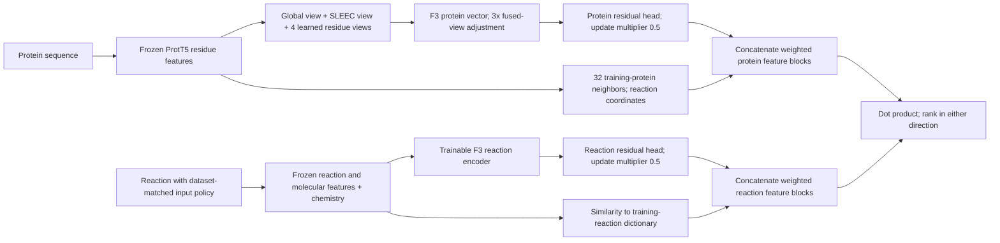

# V4: implementation, training, results and interpretation

V4 is the user's preferred configuration, recorded after reviewing the completed experiments. Its identifier is `shared_recipe_alpha04_cap05_v1`. It combines a SLEEC residue-view dual encoder, anchor-balanced multi-positive training, a separately trained full-graph residual refinement, and a fixed dictionary of training-reaction coordinates. The recorded version exceeds all 14 primary benchmark comparison targets and has the highest primary-paper recovery at 25 among the six completed configurations on the restricted Case1 panel. These are exploratory results; broad catalytic generalization remains unproven.

This explanation follows the actual implementation and frozen artifacts. The [detailed result report](shared_recipe_alpha04_cap05_v1.md) contains checkpoint links and the complete metric tables. The [six-version comparison](shared_winning_methods_20260921.md) preserves the alternatives.

**One recipe, four independently fitted target models.** V4 is a method configuration, not one universal checkpoint used unchanged on every benchmark. Reaction-Sim, Enzyme-Sim, Time and EnzymeMap each have their own freshly initialized F3 fit, phase-2 heads and training-only dictionary. The architecture and optimization settings are shared. Their downstream associations come from the relevant target split; the EnzymeMap model does not inherit a ReactZyme-trained F3 checkpoint.

| Target | Training association rows | Unique edges used by phase 2 | Training reaction dictionary size |
| --- | ---: | ---: | ---: |
| ReactZyme Reaction-Sim | 147,393 | 147,393 | 6,977 |
| ReactZyme Enzyme-Sim | 152,748 | 152,748 | 7,386 |
| ReactZyme Time | 149,554 | 149,554 | 7,281 |
| EnzymeMap | 34,427 | 34,180 | 12,603 |

The EnzymeMap row/edge difference comes from deduplicating associations. The dictionary contains training reaction IDs, not the complete screening or test catalog. The audit verifies equality between each phase-2 training graph and its target training CSV's unique edges. Reaction-Sim resumed its own optimizer state after a memory collision; it was initialized for that target, but was not an uninterrupted run.

**What remains from F3.** The design retains independent protein and reaction encoders, the existing frozen feature banks, SLEEC, and precomputable candidate representations. V4 changes the trainable protein aggregation and the learning/refinement recipe. It is a descendant of the F3 dual-encoder system. It does not combine F3 and CIRCEv2 checkpoint predictions, and it does not select different seeds for different queries.

**The protein encoder uses six views.** Each residue starts with a frozen, 1,024-dimensional ProtT5 representation. A global view averages valid residue vectors. A SLEEC view pools residues using the frozen scorer's logits. Four learned queries form four additional attention-weighted residue views. Those slots are latent summaries, not experimentally identified active sites and not four separately scored enzyme prototypes.

The learned residue adapter has hidden size 256. Slot keys and queries are normalized, attention logits have a bounded scale, and the attention distribution includes a small uniform component. A learned gate fuses the six projected views, with a floor that prevents any view's gate from becoming exactly zero. These are implementation safeguards; they do not prove that the views learned distinct biological functions. The slot attention is linear in sequence length times four slots, rather than a full residue-by-residue attention matrix.

Let `normalize` denote L2 normalization. The base protein representation has the form

\[
b_e=\operatorname{normalize}(g_e+s f_e),
\]

where the global branch output `g_e` and fused-view output `f_e` are separately normalized. The learned scalar `s` starts at 0.1 and is constrained to lie between 0 and 0.5. The final base embedding has 512 coordinates. SLEEC's scorer stays frozen; the new pooling, gates and projections learn from the target benchmark associations.

**The reaction encoder combines four feature sources.** V4 uses ReactionT5v2, Uni-Mol2, ChIRo and the existing chemistry feature vector. Their raw feature dimensions are 768, 768, 256 and 617. The trainable tower adapts the modalities and fuses them with attention into a 512-dimensional retrieval representation. For molecular side composition, the configured `directional_delta` representation concatenates reactant pooling, product pooling, their difference and the absolute difference.

The input contract matters. ReactZyme's released participant-set representation is encoded using the established self-reaction adapter, placing the complete participant set on both sides. EnzymeMap retains physical reactant/product sides. Thus the same tower can accept side-specific information when supplied, but the ReactZyme adapter cannot manufacture physical direction missing from the released representation. Retrieval direction (R→E versus E→R) is a separate concept from chemical reaction direction.

One earlier deployment error supplied a physical Case1 reaction to a historical F3 path trained on complete participant sets, omitting a molecule from modalities that read the reactant bank. Matching inference inputs to the training representation fixed that inconsistency. The correction alone did not solve activity ranking; the earlier control results in findings.md show this explicitly.

**Phase 1 trains with anchor-balanced, decoupled all-positive InfoNCE.** Original MLNCE is not V4's phase-1 objective. For an anchor `a`, let `P(a)` be its known positive partners present in the minibatch, and `N(a)` the other available partners. With cosine-based logit `z(a,j) = beta * similarity(a,j)`, the implemented per-positive term is

\[
\ell(a,p)=\log\left(1+\sum_{n\in N(a)}\exp(z(a,n)-z(a,p))\right).
\]

The terms are averaged over positives within each valid anchor, then over anchors. The two retrieval directions receive equal weight:

\[
L_{\mathrm{F3}}=0.5L_{R\to E}+0.5L_{E\to R}.
\]

This has two useful properties. Every recorded positive receives direct learning pressure, rather than allowing one easy positive to account for all positive mass. Other known positives are excluded from that positive's negative pool. Averaging within the anchor prevents an anchor with twenty positives from receiving twenty times the weight of an anchor with one positive merely because of its label count in that matrix. This balances the loss within a batch; it does not make every anchor appear equally often over an epoch.

The implementation uses `all_known_in_batch`, so positives are recognized from known training associations rather than just the sampled pair list. Nevertheless, unannotated pairs remain contrastive negatives: V4 sets `unknown_negative_weight=1.0`. The method corrects competition between known positives; it does not solve incomplete activity annotation or turn unobserved pairs into measured inactivity.

V4 fixes beta at 5, equivalent to temperature 0.2 for these logits. Beta is inverse temperature, so beta 5 creates a softer contrastive distribution than beta 10. A plausible benefit is less aggressive fitting of hard, potentially mislabeled non-edges. Separate matched EnzymeMap experiments across seeds 17, 73 and 42 favored beta 5 in 22 of 24 metric comparisons against beta 10. Those experiments used a different fixed 18-epoch recipe and are evidence about that component, not multi-seed replication of exact V4.

**The phase-1 settings are fixed.** The selected snapshot is epoch 10, batch size 512, seed 42, AdamW learning rate 0.0001 and weight decay 0.01. The ReactZyme trajectories originally continued to 20 epochs with constant learning rate; the saved epoch-10 weights are the ones used here. Training uses cached frozen features and mixed precision. SLEEC and the underlying feature encoders are pretrained resources, so “fresh F3” means fresh target-specific trainable retrieval components, not training ProtT5 or SLEEC from random initialization.

**Phase 2 is a different objective and a much smaller fit.** F3 is frozen. Each endpoint receives its own residual network, with LayerNorm, a 512→1,024 linear layer, GELU and a 1,024→512 linear layer. The final layer is initialized to zero, so the refinement starts as the original normalized representation. During its fit,

\[
u_e=\operatorname{normalize}(b_e+0.2h_e(b_e)),\quad
u_r=\operatorname{normalize}(b_r+0.2h_r(b_r)).
\]

The heads receive 100 full-training-graph optimization updates. The contrastive objective is bidirectional cross-entropy with uniform probability targets over every known positive for an anchor. Its softmax denominator includes the full relevant training bank, including the other positive partners. Consequently, phase 2 is not the phase-1 decoupled loss applied to a larger batch.

The full objective adds an identity penalty: the mean of `1 - cosine(refined, base)` over the two endpoint banks, multiplied by 10. That discourages changing the pretrained retrieval geometry too aggressively. The phase-2 temperature is 0.2, learning rate 0.0001 and weight decay 0.001. The 100 updates are full-graph updates, not 100 minibatches or an additional 100-epoch F3 run. V4 uses no Smooth-AP term, FGW term or new EC supervision in these downstream fits.

**The “0.5 residual cap” is an inference multiplier.** The implementation computes

\[
u_e=\operatorname{normalize}(b_e+0.5\times0.2h_e(b_e))
=\operatorname{normalize}(b_e+0.1h_e(b_e)),
\]

and analogously for reactions. It halves the learned residual update relative to cap 1. It is not a hard norm clamp and does not guarantee that the final vector moves by exactly half the angle. Its purpose is conservative application of the full-graph correction. This scalar is separate from the protein encoder's bounded fused-view scale.

**The 3× fusion adjustment affects the protein representation before phase 2.** After both training stages have been fitted, V4 replaces `normalize(g + s*f)` at inference with `normalize(g + 3*s*f)`, then applies the already fitted phase-2 head. It strengthens the entire fused-view branch, which itself includes the global, SLEEC and learned views; it is not simply “multiply SLEEC attention by three.”

The actual Reaction-Sim scale changes from 0.123277 to 0.369831. The other ReactZyme scales become approximately 0.373 and 0.371. EnzymeMap changes from 0.105986 to 0.317959. All remain below the configured 0.5 bound. Phase 2 was fitted before this adjustment on every target. For EnzymeMap, an equivalent calibrated checkpoint stores the scalar change; its recorded runtime multiplier is therefore 1 to avoid applying 3× twice. The calibration receipt verifies that other model parameters are unchanged.

This adjustment arose from the hypothesis that the global residual branch was dominating the learned residue information. Its interpretation is supported by the model formula and the calibration comparisons; it is not proof that any individual slot corresponds to a catalytic mechanism.

**The semantic dictionary contributes training-based similarity transfer.** A second feature block gives each endpoint coordinates indexed by the target's training reactions. It uses frozen raw features, with feature centers fitted on training endpoints only. It does not use generated descriptions or test activity labels.

For an enzyme, the encoder finds its 32 nearest training proteins in centered, normalized ProtT5 mean-feature space. It converts their similarities into exponential weights with temperature 0.03 and transfers their recorded training reaction associations into the corresponding coordinates. If several neighbors support the same reaction, the implementation takes their maximum contribution, rather than summing frequency. The resulting vector is normalized.

For a reaction, centered raw ReactionT5v2/Uni-Mol2/ChIRo/chemistry features are concatenated and normalized. Similarities to all training reactions are transformed with an exponential kernel of temperature 0.03, then normalized. Full reaction-anchor support avoids a strict disjoint-nearest-anchor zero-score failure. It cannot guarantee that a chemically remote reaction has an informative neighbor.

This block expresses an intuitive transfer path: a protein resembles training proteins associated with certain reactions, while the query reaction resembles those training reactions. That connection can provide useful retrieval evidence, but protein similarity and chemical similarity remain proxies for catalytic compatibility and specificity.

**The final V4 score has a precise 60/40 interpretation.** Let `u` be the refined neural feature and `a` the normalized training-reaction coordinate vector. Each endpoint is represented by

\[
\Phi_e=[\sqrt{0.6}\,u_e;\sqrt{0.4}\,a_e],\quad
\Phi_r=[\sqrt{0.6}\,u_r;\sqrt{0.4}\,a_r].
\]

Their dot product is

\[
S(e,r)=0.6\,u_e^\top u_r+0.4\,a_e^\top a_r.
\]

Semantic weight 0.4 means 40% of this weighted similarity expression. It is not an activity probability, a fraction of training data or a fraction of trainable parameters. The model has one fixed endpoint representation; it does not average independently trained V1–V6 predictions. There is no hubness adjustment based on the current screening pool.

The reaction and protein vectors can be computed independently. R→E holds the reaction vector fixed and ranks protein vectors; E→R reverses which collection is searched. Expensive protein feature extraction can be performed once for a screening library. The semantic block increases the representation dimension: 512 + 6,977 coordinates for Reaction-Sim and 512 + 12,603 for EnzymeMap. The protein block is naturally sparse, so dense neural vectors and sparse anchor coordinates can be stored separately while preserving the same score. This is more substantial than a plain 512-dimensional encoder and needs the frozen dictionaries for reproducible deployment.

**How V4 differs from the other versions.**

| Version | Fresh-fit family | F3 snapshot | Semantic weight | Residual multiplier | Protein fusion multiplier |
| --- | --- | --- | ---: | ---: | ---: |
| V1 | batch 512; initial scale 0.1 | 10 | 0.25 | 1.0 | 3 |
| V2 | same fitted weights as V1 | 10 | 0.40 | 1.0 | 3 |
| V3 | same fitted weights as V1 | 10 | 0.50 | 1.0 | 3 |
| V4 | same fitted weights as V1 | 10 | 0.40 | 0.5 | 3 |
| V5 | batch 1,024; initial scale 0.3 | 10 | 0.25 | 1.0 | 1 |
| V6 | same trajectories as V5 | validation-selected 20/15 | 0.25 | 1.0 | 1 |

V4 versus V2 isolates the inference residual multiplier: fitted weights, semantic weight and fusion multiplier are the same. This makes their comparison useful for understanding that change. It does not make V1–V4 independent replications. V6 uses epoch 20 for all ReactZyme splits and epoch 15 for EnzymeMap.

**The primary benchmark evidence comprises fourteen cells.**

| ReactZyme split | R→E V4 | Primary target | E→R V4 | Primary target |
| --- | ---: | ---: | ---: | ---: |
| Reaction-Sim | 0.400381 | 0.337 | 0.534366 | 0.518 |
| Enzyme-Sim | 0.666249 | 0.592 | 0.971355 | 0.956 |
| Time | 0.538285 | 0.372 | 0.780669 | 0.690 |

The primary targets take the strongest main-model comparison in each cell, rather than always choosing one TIGER variant. TIGER's main Reaction-Sim E→R result is 0.518. The separate MLP ablation reports 0.543; V4 remains below that value. The SwissProt+DGN condition reports 0.632 and uses additional human-reviewed annotation input. [TIGER Tables 1–3](https://arxiv.org/html/2605.24489v1).

Our metric averages reciprocal ranks across all known positives within each query, then averages queries. It is not first-positive MRR. With two positives at ranks 1 and 2, the contribution is 0.75 rather than 1. This matters on multi-positive R→E queries and explains why even a perfect all-positive ranking can score below 1. A local oracle audit matches the six FGW-CLIP perfect-ranking table entries to four decimals, supporting this interpretation; exact unpublished competitor implementations remain unverified.

| EnzymeMap setting | Metric | V4 | Strongest primary target |
| --- | --- | ---: | ---: |
| Table 1 | BEDROC85 | 0.572337 | 0.486600 |
| Table 1 | BEDROC20 | 0.755433 | 0.666900 |
| Table 1 | EF5 | 16.859042 | 14.910000 |
| Table 1 | EF10 | 8.958692 | 8.180000 |
| Table 2 | BEDROC85 | 0.528734 | 0.451400 |
| Table 2 | BEDROC20 | 0.726403 | 0.614300 |
| Table 2 | EF5 | 16.418633 | 13.570000 |
| Table 2 | EF10 | 8.793103 | 7.810000 |

The original EnzymeMap split has 34,427/7,287/4,642 association rows. Table 1 screens 261,907 candidate IDs with 1,521 eligible unique test reaction queries. Table 2 removes training enzyme IDs, leaving 252,113 candidate IDs and 1,337 eligible queries. Association rows, unique reaction queries, candidate IDs and unique sequences are different units; these counts should not be interchanged.

BEDROC gives exponentially greater importance to positives near the top; alpha 85 emphasizes earlier ranks more strongly than alpha 20. EF measures positive concentration in the top fraction relative to the entire candidate set. EF5 16.859 therefore means approximately 16.86 times the background positive fraction within the top 5%, not 16.86% accuracy. Five percent of this screening library is approximately 13,095 candidates, so strong EF5 does not by itself prove useful top-five wet-lab selection. EnzymeMap validation and test use BEDROC/EF, not MRR. V4 is a fixed reported candidate, with no validation fallback to another epoch or seed.

Targets combine published FGW-CLIP and the released CLIPZyme reproduction. For Table-2 EF10, CLIPZyme's published 7.81 is stronger than FGW-CLIP's 7.61, and V4 exceeds both. BEDROC values here are fractions; multiply by 100 to compare with percentage-formatted paper tables. [FGW-CLIP Tables 1–2](https://arxiv.org/html/2512.08508v1).

**Case1 is one retrospective literature panel.** The query is D-fructose to D-tagatose. All 144 requested entries were scored; deduplicating sequences gives 123 unique proteins. The primary-paper cohort contains 12 unique sequences, paper plus patent evidence contains 24, and the broader workbook-reported active cohort contains 81. The remaining 42 unique sequences have non-detect-only evidence under recorded assay conditions. These are not universal biological negatives.

V4's predeclared Reaction-Sim deployment recovers 0/12 primary-paper catalysts in the top 5, 3/12 in the top 10 and 10/12 in the top 25. Its best primary-paper hit is rank 6. The top-25 result corresponds to 83.3% recall of that cohort; it is not 83.3% activity prediction accuracy. The top 25 also contain 22/81 broader workbook actives. Absence of a primary-paper label does not mean a candidate is inactive.

On the original 144-entry ranking, 10 of 15 paper-supported entries appear in the top 25. The equal numerator does not make the 144-entry and unique-sequence evaluations equivalent: their denominators, ranks and duplicate weighting differ. Conditional AUROC on the 81 versus 42 unique-sequence comparison is 0.612875, a modest separation rather than a near-perfect activity classifier.

| Target-trained V4 model | Unique paper catalysts @25 / 12 | Conditional AUROC |
| --- | ---: | ---: |
| Reaction-Sim | 10 | 0.612875 |
| Enzyme-Sim | 5 | 0.584656 |
| Time | 5 | 0.634333 |
| EnzymeMap | 6 | 0.470606 |

The table exposes training-distribution dependence. Even the target model with higher broad-cohort AUROC need not recover more primary-paper catalysts at a particular cutoff. In particular, the EnzymeMap-trained V4 wins its screening benchmark but has weak Case1 discrimination. One architecture working on both benchmarks does not imply that each target-trained checkpoint transfers equally to this reaction.

**The incremental Case1 gain is specific and small.** With the same strengthened-fusion base encoder, native paper recovery at 25 is already 9/12. V4's final refinement raises it to 10/12; H006 moves from rank 33 to 23. The native model has one primary-paper hit in its top five, while the final V4 has none. Phase 2 improves one cutoff while worsening another.

Compared with V2, halving the residual update changes TsT4Ease M4-4 (H009) from rank 28 to 24. That accounts for V4's extra paper hit at 25 relative to V2. The gain is near a cutoff; it should not be described as a dramatic increase in biological generalization. Other ranks move in both directions: H006 worsens from V2's 17 to V4's 23 but remains within 25, and SPI-T4Ease (H013) worsens from 52 to 62.

The two primary-paper catalysts outside V4's top 25 are TsT4Ease WT (H008, rank 26) and SPI-T4Ease WT (H013, rank 62). Thus one missed catalyst is immediately outside the cutoff, while the other is much farther down.

**Homology and chemistry exposure limit the interpretation.** Four of the ten recovered paper catalysts have retrieved supervised-training homologs at 96.8–99.1% identity. H009 has a retrieved hit at 50% identity. Five recovered paper catalysts have no qualifying hit under the recorded MMseqs search, which requires at least 80% coverage on both sequences. A missing qualifying hit means unknown similarity under this search, not proof that no homolog exists. The search covers supervised Reaction-Sim training, not every frozen-backbone or SLEEC pretraining source.

Both query molecules occur together within larger training participant sets. The panel therefore provides evidence of literature-catalyst recovery under a particular representation and exposure history, not a clean demonstration of chemically distant, family-disjoint discovery. Related constructs and multiple entries from the same paper further reduce independence. No new activity assay was performed in this campaign.

**Why prefer V4 to the highest-scoring ReactZyme model?** V6 has stronger ReactZyme MRR in all six cells, including Reaction-Sim E→R 0.549547 versus V4's 0.534366. But V6's predeclared Reaction-Sim Case1 deployment recovers only 4/12 paper catalysts at 25, all with close training homologs. In the stronger-fusion training family, moving from V5's epoch-10 recipe to V6's validation-selected later recipe raises the ReactZyme scores while reducing that Case1 recovery from 7/12 to 4/12. This is direct evidence that improving these benchmark scores did not guarantee improvement on this panel.

V4 preserves all fourteen primary point-estimate wins while retaining the strongest primary-paper recovery at 25 among the completed versions. That is a reasonable tradeoff for the user's stated priorities. It remains a post-results preference: Case1 was examined during the broader campaign, and the user chose V4 after comparing outcomes. It must not subsequently be presented as a method independently selected without knowledge of this panel.

**What the evidence supports and what remains open.** The experiments establish that the recorded V4 artifacts produce the listed scores, use target-specific training associations, retain independent endpoint encoding, and recover ten of twelve primary-paper catalysts within the restricted panel's top 25. They do not isolate every component's causal contribution, establish multi-seed robustness of exact V4, verify unpublished competitor implementations, or demonstrate broad wet-lab applicability.

Pretraining is a material difference. The frozen SLEEC manifest names M-CSA/CATH residue features and pseudo-supervised training settings; it is not purely unsupervised sequence pretraining. Matching downstream benchmark associations therefore controls one major source of unfairness but does not establish an architecture-only comparison under identical total training resources.

The most useful next scientific checks would be exact V4 seed replications, component ablations with matched target data and pretrained inputs, and genuinely unused multi-reaction assay panels with explicit homology/chemistry exposure analysis. Those are recommendations, not newly launched experiments. V4's settings should remain fixed for such confirmation; changing them after every new panel would turn the panel into further development data.

**Implementation and reproducibility references.**

- [Protein residue-view encoder](../../../horizyn/enzyme_multiview.py): six views, gates and bounded fused-view scale.
- [Reaction encoder](../../../horizyn/model.py): `MultimodalReactionAttentionEncoder`, including `directional_delta`.
- [Phase-1 loss](../../../horizyn/losses.py): `DecoupledAllPositiveInfoNCELoss`.
- [Phase-2 heads and objectives](../../../horizyn/generalization_residual.py) and [full-graph trainer](../scripts/generalization_full_graph.py).
- [Semantic coordinates](../horizyn/semantic_anchors.py) and [smooth reaction responses](../horizyn/semantic_smooth.py).
- [Exact endpoint composition](../../../scripts/generalization_reactzyme_architecture_phase2.py) and [fusion adjustment](../../../scripts/generalization_multiview_calibration.py).
- [Fixed V4 protocol](../../../runs/generalization_20260919_2251/cross_paper_retraining/shared_recipe_alpha04_cap05_v1/protocol.json), [qualification results](../../../runs/generalization_20260919_2251/cross_paper_retraining/shared_recipe_alpha04_cap05_v1/qualification.json), [frozen artifact manifest](../../../runs/generalization_20260919_2251/cross_paper_retraining/shared_recipe_alpha04_cap05_v1/case1_freeze.json), and [user preference](../../../runs/generalization_20260919_2251/cross_paper_retraining/preferred_method.json).

The original protocol's `status` field is a preserved declaration-time snapshot and still says EnzymeMap was pending. Completed qualification, evaluation receipts and the later completion audit are the authoritative completion records. The immutable protocol is retained so its recorded hashes remain meaningful.
